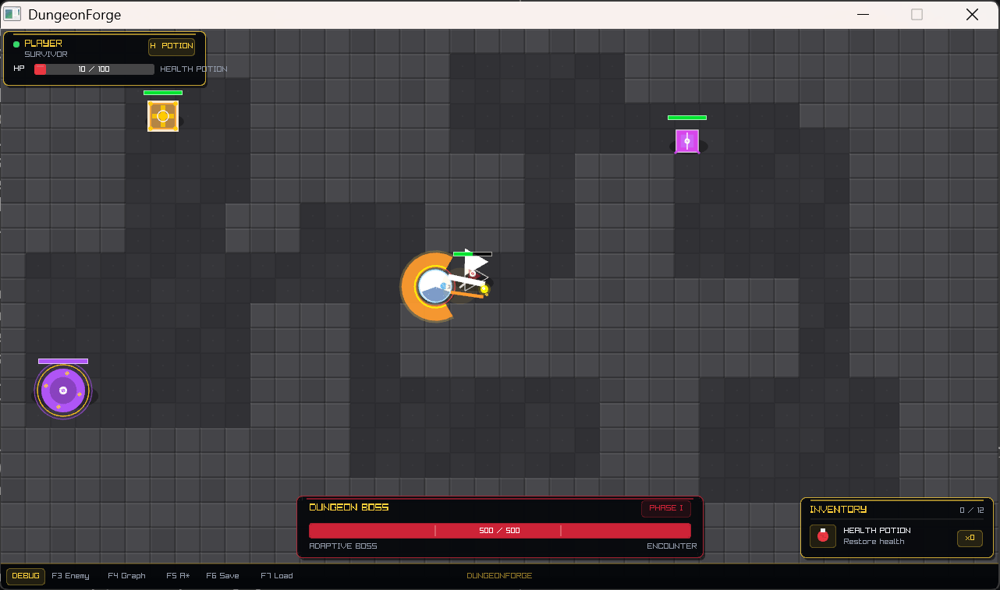
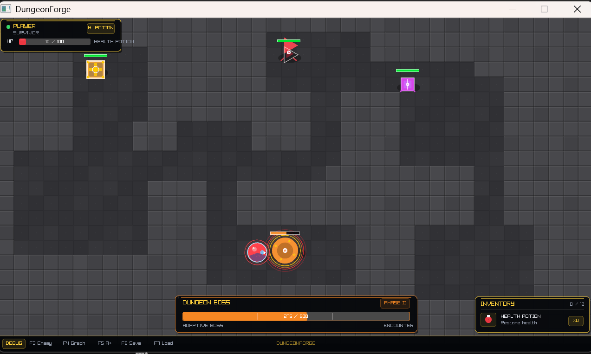
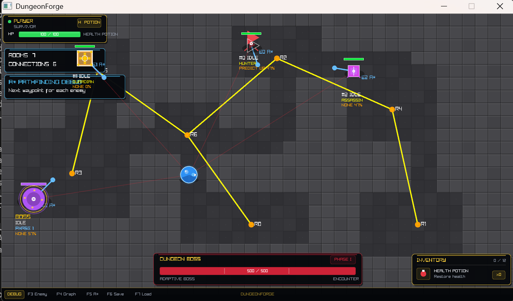
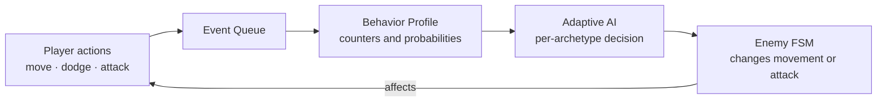
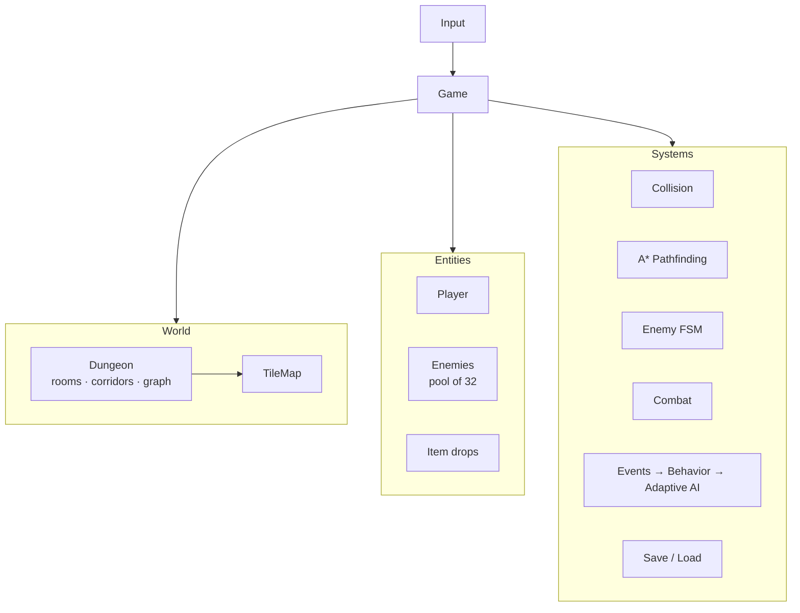

<div align="center">

# ⚔️ DungeonForge

### A 2D roguelike in pure C where the enemies learn how *you* play


-0078D6)


**Procedural dungeons · A\* pathfinding · Adaptive enemy AI · 3-phase boss · Save / Load**

[Proposal](#-project-proposal) •
[Features](#-features) •
[Adaptive AI](#-adaptive-enemy-intelligence) •
[Controls](#-controls) •
[Build](#-build-and-run) •
[Architecture](#-design-and-architecture)

</div>

---

<!--
SCREENSHOTS: take 3 screenshots of the game, save them as
docs/screenshots/gameplay.png, boss.png and debug.png,
then delete this comment markers (the lines with <!-- and -->)
so the section below becomes visible.

## 📸 Screenshots

| Gameplay | Boss Fight | AI Debug View (F3 / F5) |
|:---:|:---:|:---:|
|  |  |  |
-->

## 📋 Project Proposal

### Description

DungeonForge is a real-time 2D top-down roguelike. The player explores a procedurally generated dungeon, fights enemies, collects health potions, and defeats a multi-phase boss.

The whole project is written in **C only**. Every system (game loop, collision, pathfinding, AI, event queue, save/load) is implemented from scratch. raylib is used only for the window, drawing, input, and audio.

What makes it different is **Adaptive Enemy Intelligence**: the game records how the player moves, dodges, and attacks, builds a statistical profile, and lets enemies pick counter-strategies from it. No machine learning is used, only counters, probabilities, and decision rules.

### 🎯 Goals

- Show structured, modular C programming: clear headers, small modules, no hidden coupling
- Implement classic game algorithms by hand: tile collision, A\*, finite-state machines, procedural generation
- Build an event-driven analysis pipeline that changes gameplay
- Persist game state with versioned binary serialization
- Verify the logic-heavy modules with automated tests
- Follow good repository practice: `.gitignore`, `Makefile`, meaningful commits, license, documentation

### 📐 Specifications

| | |
|---|---|
| **Language** | C17 (`-std=c17 -Wall -Wextra`) |
| **Graphics / audio** | raylib 6.0 |
| **Build system** | GNU Make |
| **Platform** | Windows, MinGW-w64 |
| **Window** | 1280 × 720 at 60 FPS |
| **World** | 40 × 22 tile map, 32 px tiles |
| **Dungeon** | up to 20 rooms, spanning-tree connectivity, 2-tile-wide corridors |
| **Enemies** | Hunter, Guardian, Assassin + 3-phase Boss |
| **Pathfinding** | 8-direction A\*, no corner cutting |
| **Save format** | binary with magic number and version header |

---

## ✨ Features

<table>
<tr>
<td width="50%" valign="top">

**🎮 Gameplay**
- 8-direction movement
- Dodge roll with invulnerability frames
- Real-time melee combat (cone attack)
- Inventory (12 slots) and item drops
- Health potions
- HUD, boss health bar, sound effects

</td>
<td width="50%" valign="top">

**🧠 Systems**
- Procedural dungeon + dungeon graph
- A\* pathfinding with safe waypoints
- Enemy finite-state machines
- Local steering and enemy separation
- Event queue and player profiling
- Versioned binary save / load

</td>
</tr>
</table>

---

## 🧠 Adaptive Enemy Intelligence



Each enemy asks the AI for a decision about once per second. A decision only takes effect when a **probability roll succeeds**, so enemies are strong but never perfectly predictable.

| Enemy | Reads | Reaction |
|---|---|---|
| 🔺 **Hunter** | dodge habits (movement as fallback) | predicts your likely dodge direction and aims slightly ahead of it |
| 🛡️ **Guardian** | how often you attack | changes its attack tempo depending on how aggressive you are |
| 🔷 **Assassin** | dodge habits (movement as fallback) | flanks the side *opposite* your dodge habit |
| 👑 **Boss** | dodge habits (movement as fallback) | flanks or closes distance based on your tendencies |

> The learned profile is stored in the save file, so loading a game keeps what the enemies have learned.

<details>
<summary><b>👑 Boss phases</b></summary>

| Phase | Health | Speed | Behavior |
|---|---|---|---|
| I | above 70% | 150 | melee attack |
| II | 70% to 40% | 175 | melee + special attack |
| III | below 40% | 210 | enraged: faster melee, faster special |

</details>

---

## 🕹️ Controls

| Key | Action |
|:---:|---|
| `W` `A` `S` `D` | Move |
| `Shift` | Dodge |
| `Space` | Melee attack |
| `H` | Drink health potion |
| `R` | Restart after death or victory |
| `F3` | Toggle enemy debug text |
| `F4` | Toggle dungeon graph overlay |
| `F5` | Toggle A\* pathfinding overlay |
| `F6` | Save game |
| `F7` | Load game |

---

## 🛠️ Build and Run

### Prerequisites

- Windows with **MinGW-w64 (GCC)** and **GNU Make**
- **raylib 6.0** for Windows / MinGW-w64

### Quick start

```bash
# 1. Clone
git clone https://github.com/RaghavKansal-07/DungeonForge.git
cd DungeonForge

# 2. Build
make

# 3. Run (from the project root, so assets load correctly)
./dungeonforge
```

### One-time raylib setup

The repository includes the raylib **headers**, but not the compiled library. Download `raylib-6.0_win64_mingw-w64` from the [raylib releases](https://github.com/raysan5/raylib/releases) and extract it into `third_party/` so this exists:

```text
third_party/raylib-6.0_win64_mingw-w64/lib/libraylib.a
```

### Other commands

| Command | Does |
|---|---|
| `make` | build the game |
| `make test` | build and run all test suites |
| `make clean` | remove build outputs |

---

## 🧪 Testing

```bash
make test
```

| Suite | Verifies |
|---|---|
| `test_events` | FIFO order, capacity, wrap-around, empty queue, NULL handling |
| `test_behavior` | counters, probabilities, damage and heal statistics, profile restore and validation |
| `test_adaptive_ai` | decision validity, per-archetype behavior, probabilistic adaptation |
| `test_serialization` | round trip, truncated files, invalid arguments |
| `test_pathfinding` | valid and invalid inputs, same-tile and cross-room paths, unreachable goals |

These suites cover the modules that run without a window. Rendering, collision, player, and enemy FSM code are verified by playing the game.

---

## 📁 Project Structure

```text
DungeonForge/
├── Makefile
├── README.md
├── LICENSE
├── .gitignore
├── assets/audio/       sound effects (.ogg)
├── include/            headers (.h)
├── src/                implementation (.c)
├── tests/              automated test programs
├── saves/              save-game directory
└── third_party/        raylib headers (library downloaded separately)
```

---

## 🏗️ Design and Architecture



**Key design decisions**

- 📦 **Fixed-size data structures** (event ring buffer of 256, enemy pool of 32, drop pool of 32): no dynamic allocation in the game loop.
- 📨 **Event-driven analysis**: gameplay code only pushes events and never touches the AI, so the AI can be tested without a window.
- 🎲 **Deterministic dungeons**: a dungeon is regenerated from its seed, so saves store the seed and not the whole map.
- 🔐 **Versioned saves**: a magic number and version reject incompatible or foreign files.
- ✅ **Tested logic core**: modules that do not depend on raylib are built and tested on their own.

---

## 🚧 Known Limitations and Roadmap

- [x] Boss phases with special attack
- [x] Adaptive AI with probability rolls
- [x] Learned profile saved with the game
- [ ] Attacks that follow the player's facing (currently hits right only)
- [ ] Random dungeon seed per run (currently fixed)
- [ ] Enemies placed across rooms, boss in the farthest room
- [ ] Attack wind-ups so dodging matters
- [ ] Combat distance tracked in the player profile
- [ ] Obtainable Iron Sword and Iron Armor (defined, not yet droppable)

Saves are binary and not portable across compilers or platforms.

---

## 📄 License

Released under the **MIT License**. See [LICENSE](LICENSE).

<div align="center">

Built in C with ☕ and raylib

</div>